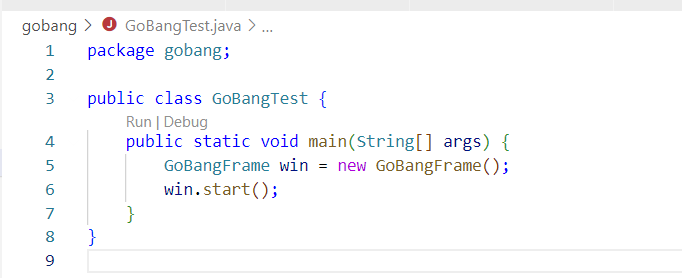
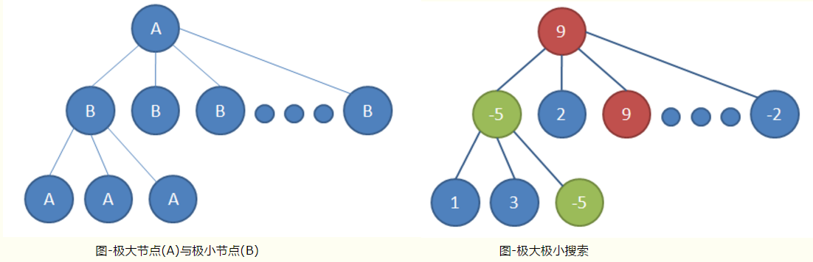
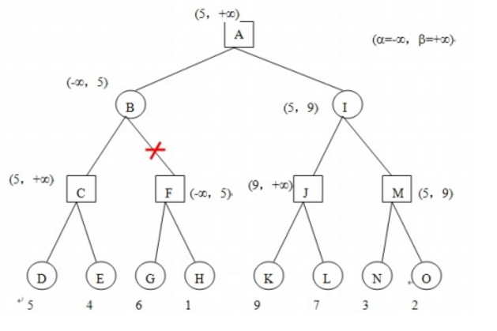

# 如何启动

将Java-Gobang整个文件夹以project形式打开

**[Note]**推荐使用vscode，安装链接https://code.visualstudio.com/docs/languages/java

执行 [GoBangTest.java](./gobang/GobangTest.java)中的main函数



# 估值函数

## 极大极小值搜索

对于一个棋局， 判断它对我来说是占优势还是劣势， 能不能用个比较确定的数值来评估呢？答案是可以的。 对于五子棋就是统计目前的棋型，并累加分数。 比如如果有4个子连起来了， 那就给个很高的评分，因为下一步就可以赢了， 如果是3个子连起来了，给个相对较低的评分，因为不一定就能赢，对方会堵你呢， 但是比只有2个子连在一起的得分要高吧， 如是就有了下面的棋型评分表：

0代表空子，1代表黑子，2代表白子。

```java
		CON_5("长连", 0, new String[] { "11111", "22222" }, 100000),
		ALIVE_4("活四", 1, new String[] { "011110", "022220" }, 10000),
		GO_4("冲四", 2, new String[] { "011112|0101110|0110110", "022221|0202220|0220220" }, 500),
		DEAD_4("死四", 3, new String[] { "211112", "122221" }, -5),
		ALIVE_3("活三", 4, new String[] { "01110|010110", "02220|020220" }, 200),
		SLEEP_3("眠三", 5,
				new String[] { "001112|010112|011012|10011|10101|2011102", "002221|020221|022021|20022|20202|1022201" },
				50),
		DEAD_3("死三", 6, new String[] { "21112", "12221" }, -5),
		ALIVE_2("活二", 7, new String[] { "00110|01010|010010", "00220|02020|020020" }, 5),
		SLEEP_2("眠二", 8,
				new String[] { "000112|001012|010012|10001|2010102|2011002",
						"000221|002021|020021|20002|1020201|1022001" },
				3),
		DEAD_2("死二", 9, new String[] { "2112", "1221" }, -5), NULL("null", 10, new String[] { "", "" }, 0);
```

电脑下棋时，会去调用getSortList函数

```java
List<ChessBean> orderList = getSortList(currentPlayer, chessBeans);
```

getSortList会计算棋盘上每个点的价值

```java
	// 计算空余未知的估值，然后排序
	private List<ChessBean> getSortList(int player, ChessBean[][] tempBeans) { // <ChessBean>

		List<ChessBean> list = new ArrayList<>();
		for (ChessBean[] chessBeans2 : tempBeans) {
			for (ChessBean chessBean : chessBeans2) {
				// 找空点
				if (chessBean.getPlayer() == 0) {
					// 计算该点对自己的价值
					int offense = getValue(chessBean.getX(), chessBean.getY(), player, tempBeans);
					// 计算该点对对手的价值
					int defentse = getValue(chessBean.getX(), chessBean.getY(), 3 - player, tempBeans);
					chessBean.setOffense(offense); // 获取该点的攻击价值
					chessBean.setDefentse(defentse); // 获取该点的防御价值
					chessBean.setSum(offense + defentse); // 获取该点的总价值
					list.add(chessBean);
				}
			}
		}
		Collections.sort(list); // 根据总价值降序排序
		return list;
	}
```

```java
	// 计算四个方向的棋型，获取Level
	private int getValue(int x2, int y2, int player, ChessBean[][] tempBeans) {
		Level level1 = getLevel(x2, y2, Direction.HENG, player, tempBeans);
		Level level2 = getLevel(x2, y2, Direction.SHU, player, tempBeans);
		Level level3 = getLevel(x2, y2, Direction.PIE, player, tempBeans);
		Level level4 = getLevel(x2, y2, Direction.NA, player, tempBeans);
		return levelScore(level1, level2, level3, level4) + position[x2][y2];
	}
```

得到最大价值之后，电脑将会落子在最大价值处，这就是估值函数算法

# 估值函数+搜索树（α-β剪枝）

这样电脑会看起来很聪明，每次下在最大收益的位子，但这对于一个棋手来说远远不够，一个专业的棋手是可以走一步看三步的。所以电脑也需要看3步



## α-β剪枝

假设博弈树的搜索情况如下图：



α为已知的最大值， β为已知的最小值， 因为还没搜索不知道是多少，保险起见，初始化为-∞  和+∞。

搜索到D的时候，局面得分是5，（顺便说一句，这样的搜索是深度优先搜索，什么是深度优先搜索，可百度）那么也就是说要搜索最大值，那么只可能会在（5，+∞） 之间， 同理，要搜索最小值，也只会在（-∞，5）之间。 
继续搜索， 搜索到G时，F暂时等于6 ，F是要找最大值， 那么F不可能再小于6了， 而B是要找最小值的，B的已知最小值是在（-∞，5）之间的， 你F还不可能比6小了， 我还要搜索你F后面的情况干嘛？不是浪费时间吗， 于是果断咔嚓掉F这个分支，不搜索了， 这就是剪枝。 
同样对于另外一边的已知可能的极限范围β也是一样的情况，遇到就算是搜索也是浪费时间的情况，就剪枝不搜索了。 
这样就减少了很多不必要是搜索步骤， 特别是一开始就找到最有可能的极大极小值， 更能迅速的剪枝。 怎么一开始尽快的找到可能的极大极小值呢， 后面再说。 先插播一下，负值极大法。

**代码如下**

```java
	protected int getValueByTrees2(int d, int player, ChessBean[][] chessBeans2, int alpha, int beta) { //
		ChessBean[][] temBeans = clone(chessBeans2);
		List<ChessBean> orderList = getSortList(player, temBeans);
		if (d == level) {
			// 达到搜索指定深度，结束。返回当前步骤中。获取到的估值最高的点。
			return orderList.get(0).getSum();
		}
		// 遍历当前棋盘上所有空余的位置（遍历getSortList）
		for (int i = 0; i < node; i++) {
			ChessBean bean = orderList.get(0);
			int score;
			if (bean.getSum() > Level.ALIVE_4.score) {
				// 找到目标
				score = bean.getSum();
			} else {
				// 这个步骤是模拟下棋。不能再真正的棋盘上进行落子
				temBeans[bean.getX()][bean.getY()].setPlayer(player);
				// temBeans[bean.getX()][bean.getY()] = bean;
				score = getValueByTrees2(d + 1, 3 - player, temBeans, alpha, beta);
			}
			if (d % 2 == 0) {
				// 自己，找最大值
				if (score > alpha) {
					alpha = score;
					if (d == 0) {
						// 结果
						chessBeansForTree = bean;
						// System.out.println(chessBeansForTree);
					}
				}
				if (alpha >= beta) {
					// 剪枝
					score = alpha;
					return score;
				}
			} else {
				if (score < beta) {
					beta = score;
				}
				if (alpha >= beta) {
					// 剪枝
					score = beta;
					return score;
				}
			}
		}
		return d % 2 == 0 ? alpha : beta;
	}
```

